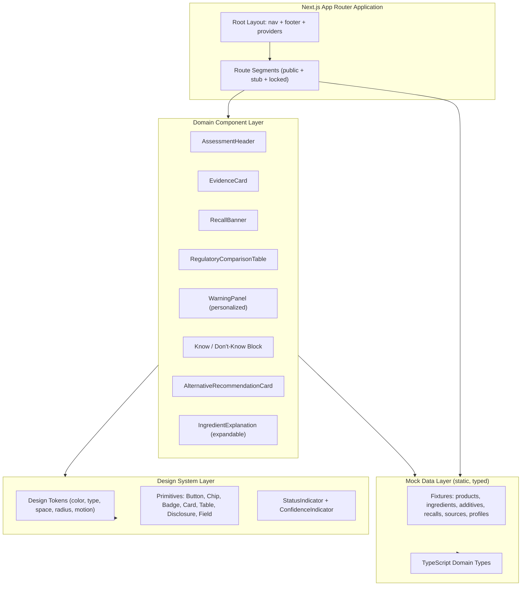
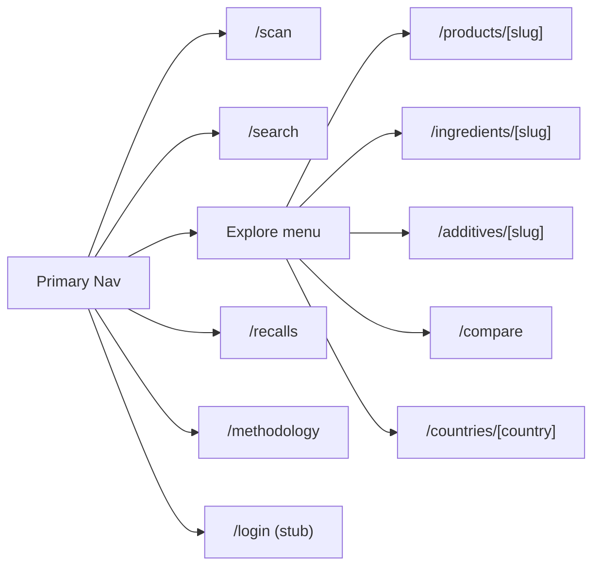

# Design Document: FoodSignal Frontend UI + Design System Prototype

## Overview

FoodSignal is a consumer product that helps people understand what is in their food and interpret the evidence behind it. This spec covers **only the frontend UI and design-system prototype**: a Next.js (App Router) + React + TypeScript + Tailwind CSS application shell with a design-token system, primary navigation, and every public page layout populated with **mock/sample data**.

The prototype is a **visual, navigable artifact**. It exists to validate information architecture, page composition, component patterns, typography, accessibility posture, and content tone. It does **not** perform any real assessment computation. The Safe / Caution / Avoid status, the 0–100 score, evidence confidence, recalls, and all other data are rendered from static, typed mock data only.

This document describes the architecture, navigation and routing, design tokens and typography, the reusable component library, per-page section specifications (including the 17-section product page), status/confidence semantics, content and language guidelines with example copy, accessibility requirements (WCAG 2.2 AA), design-level internationalization, SEO placeholders, and the TypeScript mock-data model. Explicit non-goals are called out so the boundary of the prototype is unambiguous.

## Non-Goals (Prototype Boundary)

The following are explicitly **out of scope** for this prototype and MUST NOT be built. Where a capability implies them, the UI renders a placeholder, locked state, or mock-driven view instead.

- **No real OCR/AI.** The `/scan` page presents the scan-first UI and flow affordances only; no image processing or model inference occurs.
- **No live API / backend / server data fetching.** All data comes from local typed mock fixtures.
- **No database.** No persistence layer of any kind.
- **No authentication logic.** Account routes (`/login`, `/signup`, `/profile`, etc.) are static layout stubs; there is no session, credential handling, or auth state machine.
- **No real regulatory computation.** Regulatory comparison tables and "permitted under…" statements render mock `RegulatoryRecord` data.
- **No payment / premium / billing logic.** `/pricing` is a layout only.
- **No crowdfunding / product testing functionality.** `/testing`, `/testing/[product]`, and `/testing/crowdfund/[product]` render a **locked / "Unlock soon"** state only.
- **No real assessment engine.** `AssessmentResult` values are authored mock data, not computed.

## Architecture

The prototype is a single Next.js App Router application. UI is composed from a shared design-system layer (tokens + primitives), a domain component layer (evidence cards, assessment header, recall banner, etc.), and route-level page compositions. A local mock-data module supplies all content.



### Layering Rules

- **Design System Layer** has no domain knowledge. It knows tokens and generic UI primitives.
- **Domain Component Layer** composes primitives and understands FoodSignal domain types, but reads data only via props.
- **Route/Page Layer** selects mock fixtures and passes them to domain components.
- **Mock Data Layer** is the only source of content; it is pure data plus selector helpers (`getProductBySlug`, etc.). No network, no I/O.

## Navigation & Routing

### Primary Navigation

Primary nav items, in order: **Scan | Search | Explore | Recalls | Methodology | Sign in**. The primary call-to-action, visually emphasized, is **"Scan a product"**.

- "Explore" is a grouping entry that surfaces browse destinations (products, ingredients, additives, compare, countries).
- The nav is responsive and mobile-first: on small viewports it collapses to a menu with an always-visible primary "Scan a product" CTA.
- "Sign in" links to the static `/login` stub.



### Route Inventory

**Public routes (full layouts, mock data):**

| Route | Purpose |
|---|---|
| `/` | Homepage: scan-first hero, value props, featured/sample content |
| `/scan` | Scan-first entry UI (affordances only, no OCR) |
| `/search` | Search interface for products, ingredients, barcodes |
| `/products/[slug]` | Product detail page (17 sections) |
| `/ingredients/[slug]` | Ingredient detail page |
| `/additives/[slug]` | Additive detail page |
| `/compare` | Side-by-side product/market comparison |
| `/recalls` | Recall listing |
| `/recalls/[slug]` | Recall detail |
| `/countries/[country]` | Country/market view |
| `/methodology` | How assessments are described (educational) |
| `/sources` | Source catalog / transparency |
| `/about` | About the product |
| `/pricing` | Pricing layout (no billing logic) |
| `/blog` | Editorial index |
| `/privacy` | Privacy policy layout |
| `/terms` | Terms layout |
| `/medical-disclaimer` | Medical disclaimer |
| `/data-policy` | Data policy layout |
| `/404` | Not-found page |

**Account routes (static layout stubs only, no auth):** `/login`, `/signup`, `/profile`, `/profile/allergies`, `/profile/diet`, `/history`, `/saved`, `/alerts`, `/settings`.

**Locked / future routes ("Unlock soon" state):** `/testing`, `/testing/[product]`, `/testing/crowdfund/[product]`.

## Design Tokens

Tokens are the single source of truth for visual style, mapped into Tailwind theme configuration and CSS variables. Values below are representative defaults for the prototype; exact hex values are chosen during implementation to satisfy contrast requirements.

### Token Categories

```typescript
// Design token contract (shape, not final values)
interface DesignTokens {
  color: {
    // Neutral editorial palette
    background: string
    surface: string
    surfaceMuted: string
    border: string
    textPrimary: string
    textSecondary: string
    textMuted: string
    // Brand / interactive
    brand: string
    brandHover: string
    focusRing: string
    // Status families — used ONLY as reinforcement, never as sole signal
    statusSafe: string
    statusCaution: string
    statusAvoid: string
    // Confidence is neutral (evidence quality, not danger)
    confidenceNeutral: string
  }
  typography: {
    fontSans: string        // modern sans-serif for UI
    fontDisplay: string     // optional display face for editorial headings
    fontMono: string        // tabular/numeric fallback support
    scale: TypeScaleTokens  // Display, H1, H2, H3, Body, Label, Caption
    numeric: 'tabular-nums' // regulatory/numeric values use tabular figures
  }
  space: Record<'xs' | 'sm' | 'md' | 'lg' | 'xl' | '2xl', string>
  radius: Record<'sm' | 'md' | 'lg' | 'full', string>
  shadow: Record<'sm' | 'md', string>
  motion: {
    durationFast: string
    durationBase: string
    easing: string
    // Respect prefers-reduced-motion: motion tokens resolve to 0ms
    reducedMotionSafe: boolean
  }
  breakpoints: Record<'sm' | 'md' | 'lg' | 'xl', string>
}
```

### Contrast & Color Rules

- All text/background pairings MUST meet WCAG 2.2 AA contrast (4.5:1 normal text, 3:1 large text and UI components).
- **Status is never communicated by color alone.** Every status render includes a text label and an icon/shape. Color is reinforcement only.
- Confidence uses a **neutral** visual family, distinct from status, to signal "evidence quality, not danger."

## Typography

The direction is **evidence-first, clean, trustworthy, editorial, data-rich but not a medical dashboard, mobile-first, calm not alarmist.**

| Role | Usage | Notes |
|---|---|---|
| Display | Hero headline | Optional display face; large, editorial |
| H1 | Page title | One per page |
| H2 | Section heading | e.g. product page sections |
| H3 | Subsection heading | e.g. within a section |
| Body | Paragraph / prose | Plain-language first |
| Label | Metadata labels | e.g. field labels, table headers |
| Caption | Source / date / confidence | Smallest; used for provenance |

```typescript
interface TypeScaleTokens {
  display: TypeStyle
  h1: TypeStyle
  h2: TypeStyle
  h3: TypeStyle
  body: TypeStyle
  label: TypeStyle
  caption: TypeStyle
}

interface TypeStyle {
  fontSize: string
  lineHeight: string
  fontWeight: number
  fontFamily: 'sans' | 'display' | 'mono'
  // numeric contexts opt into tabular figures
  tabularNums?: boolean
}
```

- **Numeric values** (score, nutrition amounts, regulatory limits, units) use **tabular figures** so digits align.
- Regulatory values and their **units** must be visually unambiguous (e.g. value and unit grouped, unit never orphaned or ambiguous).

## Status & Confidence Semantics

Two independent axes. They must never be conflated visually or in copy.

### Status: Safe / Caution / Avoid

```typescript
type AssessmentStatus = 'safe' | 'caution' | 'avoid'

interface StatusPresentation {
  status: AssessmentStatus
  label: string   // e.g. "Safe", "Caution", "Avoid" — ALWAYS present
  icon: string    // distinct shape per status — ALWAYS present
  // color is reinforcement only, never the sole differentiator
}
```

- Status is **always** shown with **text + icon/label**, **never color alone**.
- The three statuses use distinguishable icon shapes so they remain differentiable in grayscale, for color-blind users, and to screen readers (via accessible names).

### Confidence: Very High / High / Moderate / Low / Insufficient

```typescript
type ConfidenceLevel =
  | 'very_high' | 'high' | 'moderate' | 'low' | 'insufficient'

interface ConfidencePresentation {
  level: ConfidenceLevel
  label: string      // human-readable
  description: string // "describes evidence quality, not danger"
}
```

- Confidence describes **evidence quality, not danger**. Its visual treatment is neutral and clearly separated from status.
- Copy accompanying confidence reinforces that it is about how much is known, not about how risky the product is.

### Recall Precedence

- An **active recall banner MUST never be hidden behind a score** or collapsed below the fold on a product with an active recall. It renders prominently near the top of the page, above or independent of the score presentation, and is understandable without color or animation.

## Core Component Library

### Design-System Primitives (no domain knowledge)

| Component | Purpose |
|---|---|
| `Button` | Primary/secondary/tertiary actions; visible focus state |
| `Chip` | Compact tag; used by `SourceChip` |
| `Badge` | Small status/label marker |
| `Card` | Generic content container |
| `Table` | Semantic, screen-reader-friendly data table |
| `Disclosure` | Accessible expand/collapse |
| `Field` | Accessible form field (label, input, error, hint) |
| `Icon` | Inline SVG with accessible name |
| `VisuallyHidden` | Screen-reader-only text helper |

### Domain Components (compose primitives + domain types)

#### `StatusIndicator`

**Purpose**: Render an `AssessmentStatus` with mandatory text label + icon.

```typescript
interface StatusIndicatorProps {
  status: AssessmentStatus
  size?: 'sm' | 'md' | 'lg'
}
// Invariant: output always includes a text label and an icon; never color-only.
```

#### `ConfidenceIndicator`

**Purpose**: Render a `ConfidenceLevel` neutrally with label + explanatory caption.

```typescript
interface ConfidenceIndicatorProps {
  level: ConfidenceLevel
  showDescription?: boolean
}
```

#### `AssessmentHeader`

**Purpose**: Product assessment header combining identity, status, and score.

```typescript
interface AssessmentHeaderProps {
  product: Product
  assessment: AssessmentResult
}
// Renders StatusIndicator (text+icon) and score with tabular figures.
```

#### `ScoreDisplay`

**Purpose**: Render the 0–100 score.

```typescript
interface ScoreDisplayProps {
  score: number   // 0..100
  label?: string
}
// Invariant: numeric value uses tabular figures; score never replaces the recall banner.
```

#### `EvidenceCard`

**Purpose**: A self-contained evidence unit with claim, explanation, confidence, and sources.

```typescript
interface EvidenceCardProps {
  title: string
  body: string
  confidence?: ConfidenceLevel
  sources: Source[]
}
```

#### `SourceChip`

**Purpose**: Compact, clickable provenance chip.

```typescript
interface SourceChipProps {
  source: Source  // shows name; links to source detail/external ref
}
```

#### `RecallBanner`

**Purpose**: Prominent active-recall notice.

```typescript
interface RecallBannerProps {
  recalls: Recall[]  // active recalls
}
// Invariant: understandable without color/animation; not hidden behind score.
```

#### `RegulatoryComparisonTable`

**Purpose**: Compare a substance's regulatory status across markets.

```typescript
interface RegulatoryComparisonTableProps {
  records: RegulatoryRecord[]
  caption: string   // screen-reader-friendly table caption
}
// Renders as a semantic <table> with header scope; values + units unambiguous.
```

#### `WarningPanel` (personalized)

**Purpose**: Surface personalized warnings (e.g. matched allergens/diet) from a mock `UserProfile`.

```typescript
interface WarningPanelProps {
  profile: UserProfile
  product: Product
  // In prototype, matches are derived from mock data only.
}
```

#### `KnowDontKnowBlock`

**Purpose**: "What we know / What we don't know" transparency block.

```typescript
interface KnowDontKnowBlockProps {
  known: string[]
  unknown: string[]
}
```

#### `AlternativeRecommendationCard`

**Purpose**: Suggest an alternative product, with a mandatory disclosure label.

```typescript
interface AlternativeRecommendationCardProps {
  alternative: Product
}
// Invariant: MUST always render the disclosure:
// "Suggested alternative. This recommendation does not change the
//  safety assessment of the original product."
```

#### `IngredientExplanation` (expandable)

**Purpose**: Expandable plain-language ingredient explanation built on `Disclosure`.

```typescript
interface IngredientExplanationProps {
  ingredient: Ingredient
  explanation: string
  sources: Source[]
}
```

## Page Specifications

### Homepage (`/`)

- **Hero** (scan-first): headline **"Know what is in your food. Understand the evidence."**
- Primary CTA: **"Scan a product"**.
- Secondary CTA: **"Search a product, ingredient or barcode."**
- Supporting sections: value proposition, sample product highlight, transparency/methodology teaser, recall awareness teaser. All mock data.

### Scan (`/scan`)

- Scan-first UI with camera/upload affordances presented as **UI only** (no OCR/AI). Clear fallback to manual search. Explains what scanning would do.

### Search (`/search`)

- Search field supporting products, ingredients, and barcodes (mock results). Result cards use `StatusIndicator` + `ScoreDisplay`.

### Product page (`/products/[slug]`) — 17 sections in order

The product page renders these sections **in this order**:

1. **Product identity** — name, brand, image, barcode.
2. **Market/country** — which market this assessment applies to.
3. **Assessment status** — `StatusIndicator` (text + icon).
4. **Score** — `ScoreDisplay` (0–100, tabular figures).
5. **Key reasons** — top reasons behind the assessment (evidence cards).
6. **Ingredients** — ingredient list.
7. **Ingredient explanations** — expandable plain-language explanations.
8. **Additives** — additives with links to detail.
9. **Nutrition** — nutrition table (semantic, tabular figures, unambiguous units).
10. **Allergens** — declared allergens; personalized `WarningPanel` when a mock profile matches.
11. **Safety/regulatory checks** — `RegulatoryComparisonTable`.
12. **Recalls** — `RecallBanner` for active recalls; recall references.
13. **Potential health concerns** — plain-language, evidence-cited.
14. **Evidence confidence** — `ConfidenceIndicator` with description.
15. **Sources** — `SourceChip` list / source catalog references.
16. **Data freshness** — when data was last updated (caption style).
17. **Report correction** — "Report a correction" affordance (UI only; no submission backend).

The **recall banner (section 12 active-recall state) must remain prominent and never hidden behind the score.**

### Ingredient (`/ingredients/[slug]`) & Additive (`/additives/[slug]`)

- Identity, plain-language explanation, regulatory comparison, associated products, sources, confidence.

### Compare (`/compare`)

- Side-by-side comparison of products/markets using status, score, and key attributes with accessible tables.

### Recalls (`/recalls`) and Recall detail (`/recalls/[slug]`)

- Listing of recalls; detail page with recall specifics, affected markets, and source references.

### Country/market (`/countries/[country]`)

- Market overview; how regulatory context differs; sample products for the market.

### Methodology (`/methodology`), Sources (`/sources`)

- Educational transparency pages describing how assessments are presented and cataloging source types.

### Editorial & policy pages

- `/about`, `/pricing` (layout only), `/blog`, `/privacy`, `/terms`, `/medical-disclaimer`, `/data-policy`. The medical disclaimer uses the required wording (educational information, not diagnosis/treatment).

### Not found (`/404`)

- Friendly, accessible not-found layout with navigation back to key destinations.

### Account stubs

- `/login`, `/signup`, `/profile`, `/profile/allergies`, `/profile/diet`, `/history`, `/saved`, `/alerts`, `/settings` render **static layouts only** — no auth, no persistence.

### Locked / future

- `/testing`, `/testing/[product]`, `/testing/crowdfund/[product]` render a **locked / "Unlock soon"** state.

## Content & Language Guidelines

Bake these into the design as content rules plus example copy. Applied across all pages and components.

- **Plain language first, technical second.**
- **AVOID** these phrasings: "toxic food", "causes cancer" (without specific evidence), "100% safe", "detox", "chemical-free".
- **PREFER** phrasings such as:
  - "No active recall found in the sources checked."
  - "The ingredient is permitted under the applicable rule identified for this market."
  - "The available product-level concentration was not provided."
  - "Higher exposure is associated with…"
- **Alternative recommendations** must visibly show the disclosure:
  > "Suggested alternative. This recommendation does not change the safety assessment of the original product."
- **Medical disclaimer**: framed as educational information, not diagnosis or treatment.

## Accessibility (WCAG 2.2 AA) — First-Class Concern

- **Keyboard navigation**: all interactive elements reachable and operable by keyboard.
- **Visible focus**: clear, token-driven focus indicators on every focusable element.
- **Semantic HTML**: correct landmarks, headings, lists, and table semantics.
- **Accessible forms**: label associations, hints, and clear error messages.
- **Alt text**: meaningful alternative text for informative images; empty alt for decorative.
- **Sufficient contrast**: meet AA ratios for text and UI components.
- **No color-only status**: status and safety alerts always include text + icon/shape.
- **Reduced motion**: honor `prefers-reduced-motion`; motion tokens resolve to no motion.
- **Screen-reader-friendly tables**: captions, header scope, associations for nutrition and regulatory tables.
- **Accessible charts**: any chart provides an accessible text/table equivalent.
- **Clear error messages**: specific, actionable, programmatically associated.
- **Safety alerts** (recall banner, warnings) are fully understandable **without color or animation**.

## Internationalization (Design-Level Only)

- **Language and regulatory market are SEPARATE concepts** and never coupled.
- The UI exposes three independent controls: **interface language**, **market/location**, and **unit preferences**.
- **V1 primary interface language is English.**
- **Changing the interface language MUST NOT silently change the regulatory market.**

```typescript
interface LocalePreferences {
  interfaceLanguage: string  // e.g. "en"
  market: string             // regulatory market, independent of language
  units: 'metric' | 'imperial'
}
```

## SEO (Design-Level)

- Per-page **metadata** and **structured-data placeholders**: `Product`, `Brand`, and `FAQPage` where genuinely applicable.
- Factual snippet style, e.g.: "Ingredients, allergens, nutrition, recalls and evidence for [product] in [market]."
- Locale-aware URL / `hreflang` considerations are **noted** but not fully implemented in the prototype.

```typescript
interface PageMetadata {
  title: string
  description: string          // factual snippet style
  structuredData?: StructuredDataStub[]  // Product | Brand | FAQPage
  canonical?: string
  hreflangNote?: string        // noted, not fully implemented
}

interface StructuredDataStub {
  type: 'Product' | 'Brand' | 'FAQPage'
  data: Record<string, unknown>  // placeholder shape
}
```

## Data Models (Mock Entities)

All content is served from typed mock fixtures. These types define the shapes; fixtures instantiate them. Selectors (e.g. `getProductBySlug`) read from fixtures only — no I/O.

```typescript
interface Source {
  id: string
  name: string
  type: 'regulator' | 'scientific' | 'manufacturer' | 'database' | 'other'
  url?: string
  publishedDate?: string      // ISO date
}

interface RegulatoryRecord {
  market: string              // regulatory market identifier
  substanceId: string
  status: 'permitted' | 'restricted' | 'prohibited' | 'not_evaluated'
  limitValue?: number
  limitUnit?: string          // unit must render unambiguously
  ruleReference?: string
  sources: Source[]
}

interface Ingredient {
  slug: string
  name: string
  aliases?: string[]
  explanation: string         // plain-language first
  regulatory?: RegulatoryRecord[]
  sources: Source[]
}

interface Additive {
  slug: string
  code?: string               // e.g. E-number style identifier
  name: string
  purpose?: string
  explanation: string
  regulatory?: RegulatoryRecord[]
  sources: Source[]
}

interface Allergen {
  name: string
  declared: boolean
}

interface NutritionFact {
  label: string
  value: number
  unit: string                // unambiguous unit
  per?: string                // e.g. "per 100g"
}

interface Recall {
  slug: string
  productName: string
  market: string
  reason: string
  active: boolean
  date: string                // ISO date
  sources: Source[]
}

interface AssessmentResult {
  product_id: string
  market: string
  status: AssessmentStatus
  score: number               // 0..100
  confidence: ConfidenceLevel
  reasons: string[]
  data_freshness: string      // ISO date/time of last update
  sources: Source[]
}

interface Product {
  slug: string
  name: string
  brand: string
  barcode?: string
  imageUrl?: string
  market: string
  ingredients: Ingredient[]
  additives: Additive[]
  nutrition: NutritionFact[]
  allergens: Allergen[]
  recalls: Recall[]
  assessment: AssessmentResult
  known: string[]             // "what we know"
  unknown: string[]           // "what we don't know"
  alternatives?: Product[]
  sources: Source[]
}

interface UserProfile {
  // Mock only; no auth, no persistence.
  displayName: string
  allergies: string[]
  dietPreferences: string[]
  locale: LocalePreferences
}
```

### Assessment JSON Response Shape (Type Reference)

The prototype models the eventual assessment response shape via `AssessmentResult`:

```typescript
// { product_id, market, status, score, confidence, reasons[], data_freshness, sources[] }
type AssessmentResponse = AssessmentResult
```

### Mock-Data Strategy

- Fixtures live in a dedicated mock-data module and are strongly typed against the interfaces above.
- Provide a small but realistic catalog: several products (including at least one with an **active recall**, one with a matching **allergen** for a mock profile, and one with an **alternative recommendation**), plus ingredients, additives, recalls, sources, and one mock `UserProfile`.
- Selector helpers (`getProductBySlug`, `getIngredientBySlug`, `getAdditiveBySlug`, `getRecallBySlug`, `listRecalls`, `getMockProfile`) return typed data synchronously.
- Dynamic routes resolve params against fixtures; unknown slugs render the not-found layout.

## Error Handling

Since there is no backend, "errors" are UI states, not runtime failures.

| Scenario | Response | Recovery |
|---|---|---|
| Unknown dynamic slug (product/ingredient/additive/recall/country) | Render accessible not-found layout | Links back to Search / Home |
| Empty search query or no mock matches | Show empty state with guidance and the "PREFER" plain-language tone | Suggest scanning or browsing Explore |
| Missing optional field (e.g. concentration) | Render the PREFER copy ("The available product-level concentration was not provided.") | N/A — informative only |
| Locked route accessed | Render "Unlock soon" locked state | Link back to available features |
| Account stub interaction | Static, non-functional layout with a clear "prototype" note | N/A |

## Testing Strategy

### Unit / Component Testing Approach

- Render tests for each domain component asserting invariants: `StatusIndicator` always outputs a text label + icon; `RecallBanner` renders active recalls prominently; `AlternativeRecommendationCard` always renders the disclosure sentence.
- Route/page composition tests verifying the product page renders all 17 sections in order.

### Property-Based Testing Approach

- Applicable to pure, input-varying rendering invariants (e.g. "for any status, the rendered output contains a non-empty text label and an icon"; "for any product with an active recall, the recall banner is present"). Universal properties are enumerated in the Correctness Properties section.
- **Property Test Library**: fast-check (TypeScript).

### Integration Testing Approach

- Navigation smoke tests: primary nav routes resolve; dynamic routes resolve known slugs and fall back to 404 for unknown slugs.
- Accessibility checks (e.g. axe) on representative pages as example-based tests.

## Dependencies

- **Next.js** (App Router), **React**, **TypeScript**, **Tailwind CSS** with a design-token system.
- **fast-check** for property-based tests; a component testing runner (e.g. Vitest/Jest + Testing Library) and an accessibility checker (e.g. axe) for example-based tests.
- No runtime backend, database, auth, payment, OCR/AI, or live-feed dependencies.

## Correctness Properties

*A property is a characteristic or behavior that should hold true across all valid executions of a system — essentially, a formal statement about what the system should do. Properties serve as the bridge between human-readable specifications and machine-verifiable correctness guarantees.*

### Property 1: Status is never color-only

For any `AssessmentStatus`, the rendered `StatusIndicator` output contains a non-empty text label and a non-color icon/shape indicator, such that status is distinguishable without relying on color.

**Validates: Requirements 6.1, 6.2, 6.3, 6.4, 20.6**

### Property 2: Active recall is always surfaced

For any product that has at least one active recall, the rendered product page includes a visible recall banner that is not suppressed or replaced by the score display.

**Validates: Requirements 8.1, 8.2, 13.1**

### Property 3: Alternative recommendation always discloses

For any alternative recommendation rendered, the mandatory disclosure sentence ("Suggested alternative. This recommendation does not change the safety assessment of the original product.") is present in the output.

**Validates: Requirements 11.1, 11.2**

### Property 4: Product page section order is invariant

For any product, the rendered product page presents the 17 defined sections in the specified order.

**Validates: Requirements 13.1**

### Property 5: Confidence is visually separated from status

For any `ConfidenceLevel`, the rendered `ConfidenceIndicator` uses the neutral confidence treatment (not a status color family) and includes copy indicating it describes evidence quality, not danger.

**Validates: Requirements 7.2, 7.4**

### Property 6: Unknown slugs resolve to not-found

For any dynamic route slug that does not match a mock fixture, the route renders the accessible not-found layout rather than throwing or rendering partial content.

**Validates: Requirements 2.3, 23.5**

### Property 7: Language change does not change market

For any change to the interface-language preference, the selected regulatory market value remains unchanged.

**Validates: Requirements 21.3, 21.4**

### Property 8: Numeric values use tabular figures

For any rendered score, nutrition value, or regulatory limit value, the numeric output is styled with tabular figures and, where a unit applies, the unit is rendered unambiguously alongside the value.

**Validates: Requirements 5.3, 5.4**
